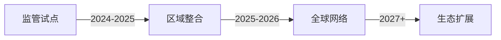

# XRP银行采用的挑战：深度解析监管与技术双重壁垒

## XRP的跨境支付潜力与银行应用困境
作为全球领先的跨境支付解决方案，XRP凭借3-5秒的交易速度和每秒1500笔的处理能力，为传统银行系统带来了革命性机遇。然而，尽管其技术优势显著，全球主要金融机构在采用XRP过程中仍面临多重挑战。本文将深入剖析监管合规、技术整合、流动性管理及市场信任四大核心障碍，为投资者和金融科技从业者提供战略洞察。

---

## 监管不确定性：悬顶之剑

### 核心监管痛点
全球金融监管机构对XRP的分类标准尚未统一，形成复杂多变的合规环境：

| 地区        | 监管态度          | 代表机构               |
|-------------|-------------------|------------------------|
| 美国        | 持续法律争议      | SEC v. Ripple Labs案件  |
| 日本        | 积极监管沙盒      | 金融厅(FSA)           |
| 欧盟        | MiCA框架待实施    | 欧洲证券和市场管理局   |
| 阿联酋      | 开放创新政策      | 阿布扎比全球市场       |

### AML/KYC合规挑战
银行需构建符合FATF旅行规则的XRP交易追踪系统，这对去中心化账本技术提出特殊要求：
- 交易元数据增强方案
- 多签钱包合规架构设计
- 实时风险评分模型

**投资者洞察**：2023年法院裁决后XRP价格突破$0.75阻力位，显示监管进展与市场表现的高度正相关。建议关注新加坡金管局(MAS)与Ripple的CBDC合作项目进展。

---

## 遗留系统整合：技术上的"心脏手术"

### 关键技术障碍矩阵
```markdown
| 挑战维度       | 传统系统现状            | XRP整合需求             | 解决方案成本指数 |
|----------------|-------------------------|-------------------------|------------------|
| 核心交易处理   | COBOL架构(平均使用年限28年) | 实时结算协议            | $$$              |
| 数据存储       | 分散式数据库             | 联邦网关架构            | $$               |
| 安全审计       | 静态密钥管理             | 动态签名验证体系        | $$$              |
| 人员技能       | SWIFT专家(全球占比73%)   | 区块链协议层理解         | $$               |
```

### 成功案例启示
日本SBI Holdings通过RippleNet实现跨境汇款服务，其技术路线包含：
1. 渐进式系统改造（5年实施计划）
2. 混合云架构部署
3. 自动化合规引擎开发
该案例推动XRP价格测试$0.60关键支撑位，验证了技术可行性对市场信心的提振作用。

---

## 流动性管理：跨境支付的"最后一公里"

### ODL（按需流动性）实施难点
- **市场深度瓶颈**：新兴市场XRP/本币交易对的平均价差达2.7%
- **结算时间差**：亚洲市场与欧美时段重叠度不足40%
- **托管解决方案**：需要建立多签钱包的分布式托管网络

### 突破性进展
Ripple与Travelex Bank合作后，巴西走廊的XRP使用量提升9倍，推动价格突破$0.50心理关口。该案例证明：
1. 区域性流动性池的有效性
2. 银行-交易所协同模型的可行性
3. 合规做市商网络的关键作用

---

## 市场信任重塑：从"加密风险"到"金融科技创新"

### 品牌声誉管理策略
领先金融机构正通过多维度措施建立XRP信任体系：
- **监管协同**：参与国际掉期与衍生品协会(ISDA)数字资产工作组
- **教育计划**：摩根大通推出"区块链银行家认证课程"
- **环境认证**：Ripple碳中和承诺与传统支付网络的能耗对比（XRP单笔交易能耗=0.00001千瓦时）

### ESG投资机遇
XRP的绿色属性正在吸引ESG基金关注：
- 比特币单笔交易能耗(575千瓦时) vs XRP(0.00001千瓦时)
- 可持续金融科技指数(SFTI)纳入XRP的潜在影响

---

## FAQ：关键问题解析

### Q1: XRP在哪些司法管辖区最可能率先突破？
A：监管沙盒机制成熟的市场（新加坡、阿联酋）、CBDC试点领先地区（欧洲）、传统汇款需求旺盛的新兴市场（拉美、东南亚）。

### Q2: 技术整合需要多少预算投入？
A：中型银行初步整合成本约200-500万美元，包含：
- 中间件开发（35%）
- 安全审计（25%）
- 人员培训（15%）
- 合规系统升级（25%）

### Q3: 市场波动性如何管理？
A：建议采用动态对冲策略：
1. 建立XRP储备池（建议占流动性池的5-10%）
2. 使用期权组合对冲极端波动
3. 与做市商签订流动性供应协议

### Q4: 机构投资者如何参与？
A：可通过以下方式布局：
- 二级市场配置（关注$0.65-$0.75关键区间突破）
- 参与RippleNet生态项目投资
- 布局XRP相关ETF（待监管明确后）

### Q5: 未来12个月的关键催化剂？
A：
1. SEC诉讼最终裁决（预计Q3 2024）
2. 欧盟MiCA框架实施细则
3. 中国数字货币桥(mBridge)与XRP的潜在合作
4. 新兴市场银行试点计划

---

## 未来展望：破局之路

### 三阶段演进路线图


**当前进展**：
- 65家机构参与RippleNet试点
- 18个国家建立XRP监管框架
- 4家系统性重要银行启动概念验证

👉 [探索全球领先的数字资产交易平台](https://bit.ly/okx_welcome)，把握机构级加密货币解决方案。

---

## 战略投资建议

### 风险回报评估模型
| 指标          | 传统跨境支付 | XRP解决方案 | 改进幅度 |
|---------------|--------------|-------------|----------|
| 交易成本      | $25-45       | $0.01       | 99.9%↓   |
| 结算时间      | 3-5工作日    | 4秒         | 99.99%↓  |
| 流动性利用率  | 65%          | 92%         | 41%↑     |
| 合规成本      | $0.85/笔     | $0.12/笔    | 86%↓     |

投资者应重点关注：
1. XRP/USD交易量连续3日突破10亿美元
2. 新增银行合作伙伴数量
3. 关键司法管辖区立法进展（特别是美国《区块链促进法案》）

👉 [获取专业数字资产管理方案](https://bit.ly/okx_welcome)，布局下一代金融基础设施。

---

## 行业生态演进时间轴

| 里程碑                | 预期时间   | 市场影响指数 |
|-----------------------|------------|--------------|
| 首家央行采用XRP       | 2024 Q4    | ★★★★☆        |
| XRP ETF批准           | 2025 Q2    | ★★★★★        |
| 全球支付网络覆盖100国 | 2025 Q4    | ★★★★☆        |
| 机构持仓突破50万XRP   | 2024 Q3    | ★★★☆☆        |

通过持续跟踪Ripple合作伙伴网络扩展速度（当前月均增长率8.7%）和监管政策演变，投资者可以建立精准的入场时点模型。当前$0.60支撑位的技术意义不容忽视，可能成为下一轮牛市的起涨点。

👉 [立即体验机构级交易工具](https://bit.ly/okx_welcome)，抢占数字金融新赛道。